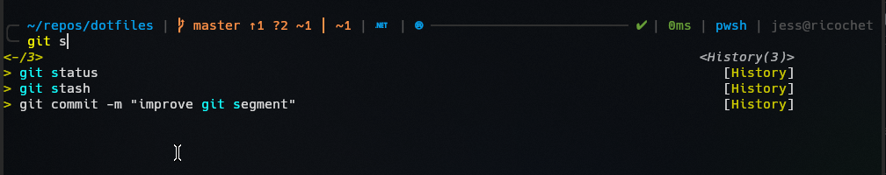
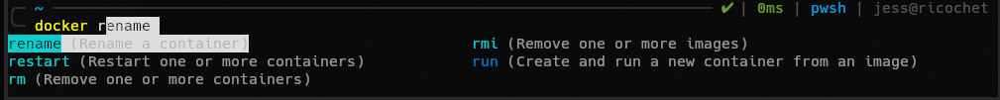
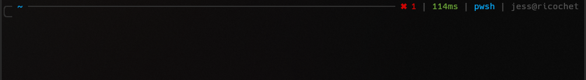
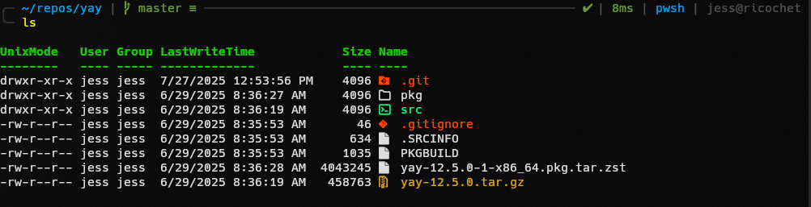

# FracturedCode/dotfiles

## Images

### History search

### Tab completion (with [carapace](https://github.com/carapace-sh/carapace-bin))

### Non-zero exit code

### ls output


## Try it out with docker (leave no trace)

```sh
curl https://raw.githubusercontent.com/FracturedCode/dotfiles/refs/heads/master/Dockerfile \
	| docker build --build-arg "USER=$(whoami)" --target try-remote -t FracturedCode/dotfiles - \
	&& docker run --rm -it FracturedCode/dotfiles
```

Or, if you git cloned the repo and want to try out your local changes:
```sh
docker build --build-arg "USER=$(whoami)" --target try-local -t FracturedCode/dotfiles . \
	&& docker run --rm -it FracturedCode/dotfiles
```

## Compatibility

OS:
- Linux, tested specifically on
	- Alpine
	- Arch
- MacOS 15

Architecture:
- x64
- arm64

## Installation

Prereqs:
- [yadm](https://yadm.io/docs/install)

```sh
cd "$HOME"
yadm clone git@github.com:FracturedCode/dotfiles.git
```

It is recommended to run the bootstrap script when prompted, or manually with `yadm bootstrap`.

> [!WARNING]
> The bootstrap script is destructive! It removes clutter from $HOME in order to configure in a more XDG-compliant way.

## Recommmended software

For the prompt:
- zsh or pwsh (pwsh preferred)
- [Oh My Posh](https://ohmyposh.dev/)
- [vivid](https://github.com/sharkdp/vivid)
- [carapace](https://github.com/carapace-sh/carapace-bin)
- [fastfetch](https://github.com/fastfetch-cli/fastfetch)


## Yadm configuration

See [the "Class and Overrides" section of the alternates page in the yadm docs.](https://yadm.io/docs/alternates#).

Classes available:
- work